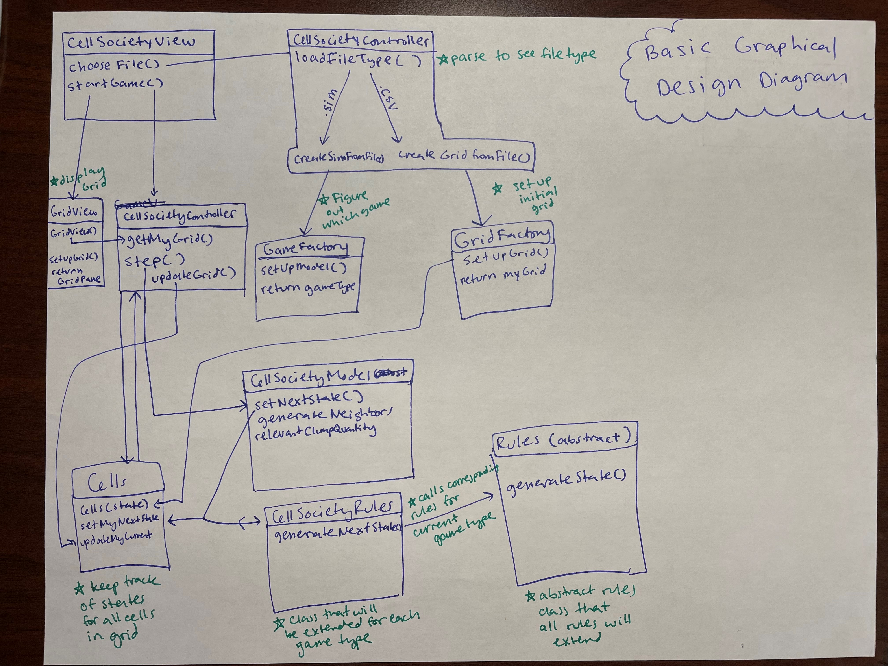
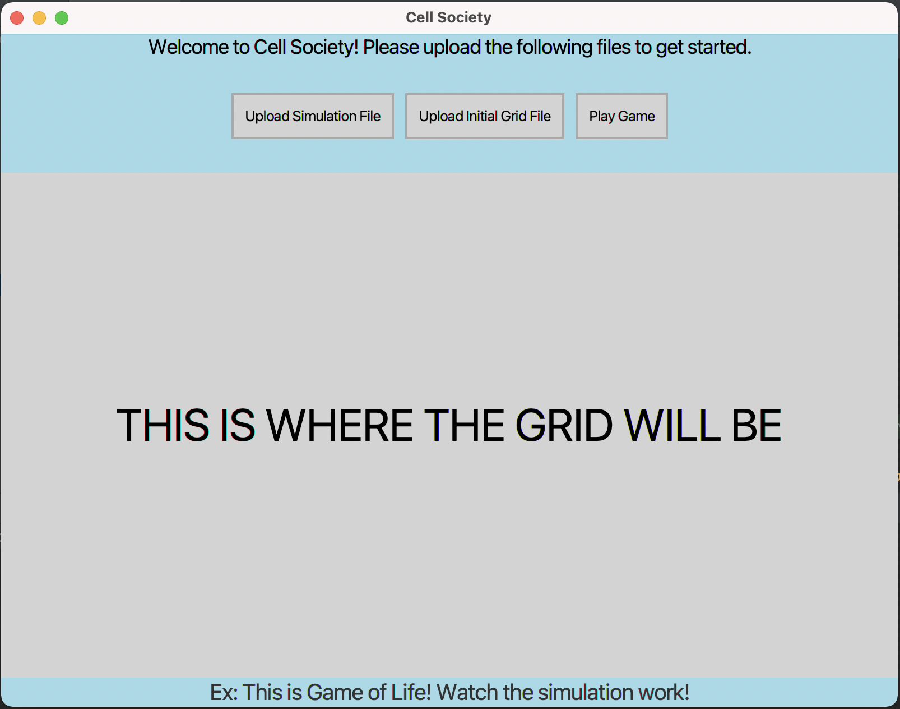

# Cell Society Design Plan
### Team Number: 9
### Names: Reya Magan, Amr Tagel-Din, Luke Josephy, Evelyn Cupil-Garcia

## Design Overview
For our implementation of Cell Society, we are planning
to use a Model-View-Controller approach with abstraction 
to implement each of the different cell automaton applications.
Our view will be the starting point of our application such that
users will be able to load a game file to play one of the game options.
This file will then be sent into our controller for further parsing.
Within the controller we will first parse the .csv file to create
the grid for our game with the correct initial "live" and "dead" cells.
Then, we would parse through the .sim file to find the type of game. Since we
are planning to have an abstract game class and have each game extend it, we could call the
game that is found in the .sim file. We would then start the animation for this game,
and have an abstract rules class (from which the relevant rules for this game would be loaded up)
constantly checking through each cell to update its state. This state would be present in the model,
and we would send this data to the view for constant display.

## Design Details

Here is a graphical look at my design:

## Design Considerations

#### Design Issue #1: How should we deal with all of the rules within the game

 * Alternative #1: We can have an abstract rules class that has an abstract getNextState method that returns the next state of a cell dependent on its neighbors.
We can have all of the possible rules extend this class (one alive neighbor, three alive neighbors, probability rules etc.) Each rule would have their own executeRule method that does the correct
rule execution for the game.

 * Alternative #2: We can have an abstract ruleStructure class with the same abstract executeRule method as Alternative #1. However, instead of having every rule exist as its own class, we could have different classes
for each type of game (Game Of Life, Percolation, etc.). We could then have an abstract rules class that extends each type of rule, but this way we would know which rules to call for each game type.

 * Trade-offs: Extending different types of rules and then having methods for each rule might not be the best design. It could make each type class really long, and could cause a decent amount of repeated code. It could also be too specific and hard to extend if we get a totally different type of rule introduced.  If we have each rule in its own class, we can easily add more and keep it fairly easy to follow. It could get long, so maybe we could organize them into packages for better readability. If we keep the rule structure set up to have each game type call certain rules we would be able to have multiple rules extending the abstract rules class, and always call the correct rules for a game.

#### Design Issue #2

 * Alternative #1

 * Alternative #2

 * Trade-offs

## User Interface

Here is our amazing UI:

## Team Responsibilities

 * Team Member #1: Reya - working primarily on the backend, Controller connections between model and view. Setting up abstractions to allow extendability for different game and rule types.

 * Team Member #2: Evelyn - working primarily on the frontend, displaying grid mechanics for each game.

 * Team Member #3: Luke - working primarily on the frontend, developing overall screen structure and styling

 * Team Member #4 Amr - working primarily on the backend, Controller connections as well as model set up to hold cell states. Setting up rules for different types of games.

#### Proposed Schedule

* 10/19: Game of Life with full functionality, well-tested
* Between 10/19 - 10/25: Implement all other applications using abstractions and following design principles such as Single-Responsibility and Open-Close
* 10/25: All other games with 90% + functionality, well-tested with error handling and the ability to extend in multiple ways
* Between 10/25 - Nov 1: Fixing functionality within original games, adding the new addition that was given to us, all with complete testing.
* Nov 1: Finished project with good functionality and strong design.
