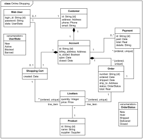

# Cell Society Design Plan
### Team Number
### Names

## Design Overview
For our implementation of Cell Society, we are planning
to use a Model-View-Controller approach with abstraction 
to implement each of the different cell automaton applications.
Our view will be the starting point of our application such that
users will be able to load a game file to play one of the game options.
This file will then be sent into our controller for further parsing.
Within the controller we will first parse the .csv file to create
the grid for our game with the correct initial "live" and "dead" cells.
Then, we would parse through the .sim file to find the type of game. Since we
are planning to have an abstract game class and have each game extend it, we could call the
game that is found in the .sim file. We would then start the animation for this game,
and have an abstract rules class (from which the relevant rules for this game would be loaded up)
constantly checking through each cell to update its state. This state would be present in the model,
and we would send this data to the view for constant display.

## Design Details

Here is a graphical look at my design:

made from [a tool that generates UML from existing code](http://staruml.io/).

## Design Considerations

#### Design Issue #1

 * Alernative #1

 * Alernative #2

 * Trade-offs

#### Design Issue #2

 * Alernative #1

 * Alernative #2

 * Trade-offs

## User Interface

Here is our amazing UI:

taken from [Brilliant Examples of Sketched UI Wireframes and Mock-Ups](https://onextrapixel.com/40-brilliant-examples-of-sketched-ui-wireframes-and-mock-ups/).

## Team Responsibilities

 * Team Member #1

 * Team Member #2

 * Team Member #3

 * Team Member #4

#### Proposed Schedule
